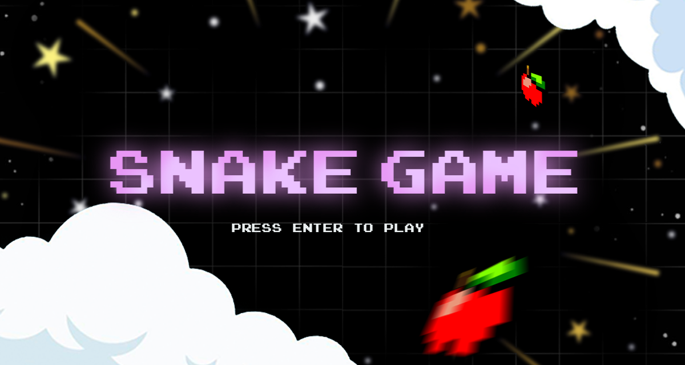
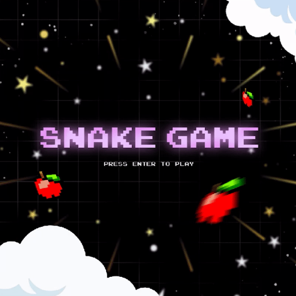

<!-- BADGES -->
[![Stargazers][stars-shield]][stars-url]
[![MIT License][license-shield]][license-url]
[![LinkedIn][linkedin-shield]][linkedin-url]

<!-- TABLE OF CONTENTS -->
<details>
    <summary>Table of Contents</summary>
    <ol>
    <li>
        <a href="#snake-game">snake-game</a>
    </li>
    <li>
        <a href="#getting-started">Getting Started</a>
        <ul>
            <li><a href="#prerequisites">Prerequisites</a></li>
            <li><a href="#installation">Installation</a></li>
        </ul>
    </li>
    <li>
        <a href="#demo">Demo</a>
    </li>
    <li>
        <a href="#game-controls">Game Controls</a>
    </li>
</details>

<!-- SNAKE-GAME -->
# snake-game

A Python implementation of the classic Snake Game, built using the Pygame library. The game is a simple and fun arcade-style game where the players control a snake that moves around the game board, eating apples to grow in size while avoiding the walls and the snake's own tail.

<!-- GETTING STARTED -->
## Getting Started

### Prerequisites
* Python: You can download the latest version of Python
[here](https://www.python.org/downloads/).

* Pygame:
    ```sh
    pip install pygame
    ```

<!-- INSTALLATION -->
### Installation
1. Clone the repository:
    ```sh
    git clone https://github.com/23Shade/snake-game.git
    ```
2. Navigate to the game directory: 
    ```sh
    cd snake-game
    ```

3. Run the game:
    ```sh
    python main.py
    ```

<!-- DEMO -->
## Demo
|    Feature    |                          Visual                          |
| ------------- | ---------------------------------------------------------|
| *Main Menu*   |  |
| *Game*        |      |
| *Game Over*   |  |

<!-- GAME CONTROLS -->
## Game Controls
|                 Key                 |     Action     |
| ----------------------------------- | -------------- |
| <kbd>Enter</kbd>                    | Start the game |
| <kbd>Esc</kbd>                      | Exit the game  |
| <kbd>&uarr;</kbd> / <kbd>W</kbd>    | Move Up        |
| <kbd>&darr;</kbd> / <kbd>S</kbd>    | Move Down      |
| <kbd>&larr;</kbd> / <kbd>A</kbd>    | Move Left      |
| <kbd>&rarr;</kbd> / <kbd>D</kbd>    | Move Right     |

<!-- URL -->
<!-- STARS -->
[stars-shield]: https://img.shields.io/github/stars/23Shade/snake-game?color=yellow&style=for-the-badge
[stars-url]: https://github.com/23Shade/snake-game/stargazers
<!-- LICENSE -->
[license-shield]: https://img.shields.io/github/license/23Shade/snake-game?color=success&style=for-the-badge
[license-url]: https://github.com/23Shade/snake-game/blob/main/LICENSE
<!-- LINKEDIN -->
[linkedin-shield]: https://img.shields.io/badge/-LinkedIn-black.svg?style=for-the-badge&logo=linkedin&colorB=informational
[linkedin-url]: https://linkedin.com/in/shadealbios
